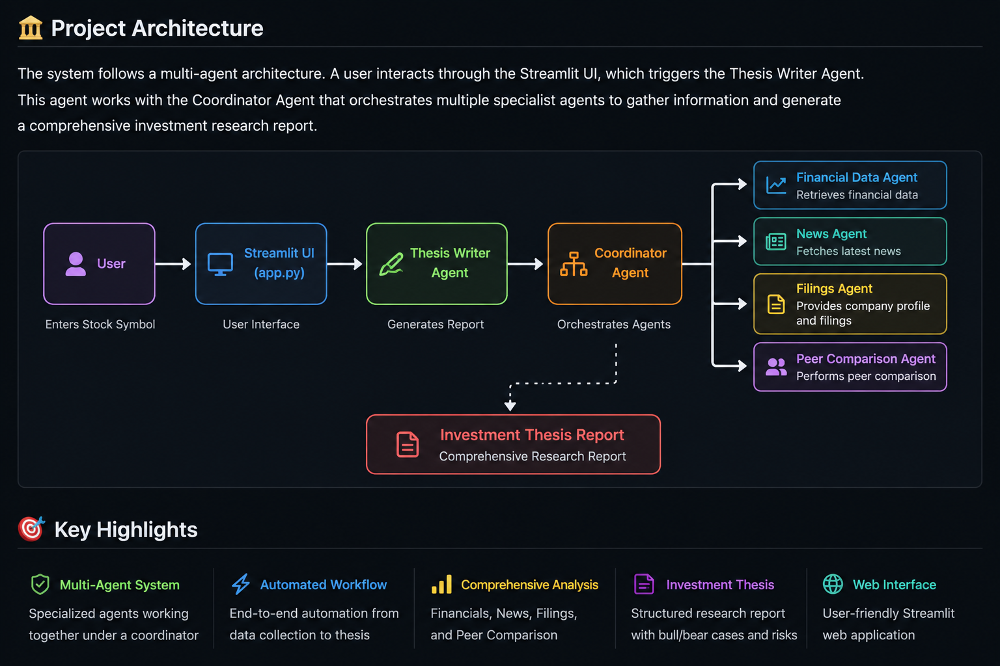

# 🚀 Multi-Agent Financial Research Analyst

## Google ADK | TCS Xcelerate Program – Use Case B

A Multi-Agent Financial Research System that automates equity research by collecting financial data, company information, recent news, peer comparisons, and generating investment research reports.

---

# 📌 Project Overview

This project was developed as part of the **TCS Xcelerate Program (Use Case B)**.

The system uses a **Multi-Agent Architecture** where specialized agents collaborate to perform company analysis and generate structured investment reports.

The project also includes a **Google ADK Integration Layer**, demonstrating agent orchestration through reusable tools and workflows.

---

# ✨ Key Features

✅ Financial Data Analysis

✅ Latest News Retrieval

✅ Company Filings Summary

✅ Dynamic Peer Comparison

✅ Investment Thesis Generation

✅ Streamlit Web Interface

✅ Automated Report Generation

✅ Google ADK Integration

✅ Session Management

✅ Sector-Specific Peer Selection

---

# 🏗️ System Architecture



---

# 🤖 Agents Implemented

## 1. Coordinator Agent

Acts as the central controller of the system.

**Responsibilities:**

* Receives user stock symbol
* Invokes all specialist agents
* Aggregates results
* Generates unified company reports

---

## 2. Financial Data Agent

Retrieves company financial information.

**Data Collected:**

* Current Price
* Market Capitalization
* PE Ratio
* Sector
* Industry

---

## 3. News Agent

Retrieves company-related news.

**Outputs:**

* Latest Headlines
* Company Updates
* Market Developments

---

## 4. Filings Agent

Retrieves company profile information.

**Outputs:**

* Business Summary
* Employee Count
* Company Website

---

## 5. Peer Comparison Agent

Performs sector-specific peer analysis.

### Technology Companies

* TCS
* Infosys
* Wipro

### Banking Companies

* HDFC Bank
* ICICI Bank
* SBI

---

## 6. Thesis Writer Agent

Generates investment research reports.

### Sections Generated

* Financial Summary
* Latest News
* Business Overview
* Bull Case
* Bear Case
* Risks
* Investment Thesis

---

# 🔗 Google ADK Integration

The project includes a dedicated ADK layer built on top of the existing agents.

## ADK Tools Implemented

### Financial Tool

Retrieves financial metrics from the Financial Agent.

### News Tool

Retrieves recent company news.

### Filings Tool

Retrieves company profile and business information.

### Peer Tool

Performs sector-specific peer comparison.

### Coordinator Tool

Combines all ADK tools into a unified workflow.

### Session Manager

Stores and retrieves contextual information.

---

# 🔄 ADK Workflow

User Request

     ↓

Coordinator Tool

     ↓

Financial Tool

     ↓

News Tool

     ↓

Filings Tool

     ↓

Peer Tool

     ↓

Session Manager

     ↓

Final Research Report

---

# 🛠️ Technologies Used

* Python
* Google ADK
* Streamlit
* Yahoo Finance (yfinance)
* Requests
* BeautifulSoup4
* Pandas
* lxml
* Git
* GitHub

---

# 📂 Project Structure

```text
TCS-Xcelerate-UseCase-B/
│
├── financial_agent.py
├── news_agent.py
├── filings_agent.py
├── peer_comparison_agent.py
├── coordinator_agent.py
├── thesis_writer_agent.py
├── app.py
│
├── adk/
│   ├── financial_tool.py
│   ├── news_tool.py
│   ├── filings_tool.py
│   ├── peer_tool.py
│   ├── coordinator_tool.py
│   └── session_manager.py
│
├── architecture_document.md
├── evaluation_report.md
├── DEPLOYMENT.md
└── README.md
```

---

# ⚙️ Installation

### Clone Repository

```bash
git clone <repository-url>
```

### Navigate to Project

```bash
cd TCS-Xcelerate-UseCase-B
```

### Create Virtual Environment

```bash
python3 -m venv tcs_env
```

### Activate Environment

```bash
source tcs_env/bin/activate
```

### Install Dependencies

```bash
pip install -r requirements.txt
```

---

# ▶️ Running the Application

### Streamlit Interface

```bash
streamlit run app.py
```

or

```bash
python3 -m streamlit run app.py
```

---

# 📊 Evaluation

The system was evaluated using 10 publicly listed Indian companies:

* Tata Consultancy Services (TCS)
* Infosys
* Wipro
* Reliance Industries
* HDFC Bank
* ICICI Bank
* State Bank of India (SBI)
* Larsen & Toubro (L&T)
* ITC
* Bharti Airtel

Results are documented in:

```text
evaluation_report.md
```

---

# ✅ Current Status

### Completed

* Multi-Agent Architecture
* Streamlit Web Interface
* Dynamic Peer Comparison
* Google ADK Integration
* Coordinator Workflow
* Session Management
* Evaluation Report
* Documentation

---

# 🚀 Future Enhancements

* AI-Powered Thesis Generation
* Advanced News Filtering
* Cloud Deployment
* Persistent Database Storage
* Enhanced Agent Memory

---

# 👨‍💻 Author

**Smrutiranjan Behera**

TCS Xcelerate Program – Use Case B
